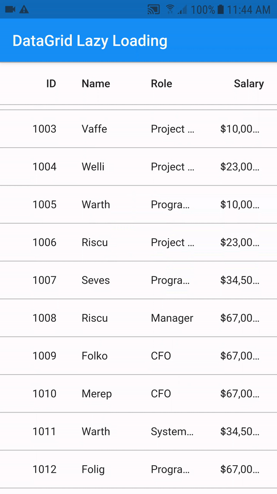
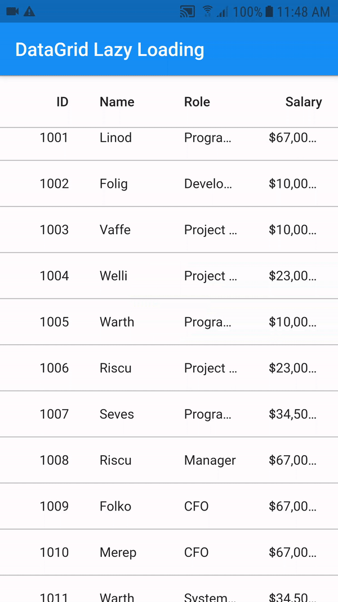

#  Perform lazy loading in Flutter DataTable (SfDataGrid).

The Syncfusion Flutter DataTable (SfDataGrid) provides support to load data lazily with interactive view when the grid reaches its maximum offset while scrolling down.

In this blog, we are going to discuss how to enable the load more feature in Flutter DataTable and perform the lazy loading of data fetching from firebase. Before getting into the steps, go through the overview of connecting the firebase in application.

Note: In this blog, we use firebase data for example purpose, and we are not providing the firebase connectivity files.

## Let’s get started.

Dependency Package.

Include the Syncfusion Flutter DataGrid and firebase responsible package dependency in the pubspec.yaml file of your project with the following code

```xml

firebase_core: ^1.0.2
cloud_firestore: ^1.0.3
syncfusion_flutter_datagrid: ^19.1.54-beta.1

```

### Creating model data class.

Create employee class to cast and store the firebase data in your local.

```xml

import 'package:cloud_firestore/cloud_firestore.dart';

class Employee {
  Employee(this.employeeID, this.employeeName, this.designation,
      this.salary,
      {this.reference});

  double employeeID;

  String employeeName;

  String designation;

  double salary;

  DocumentReference? reference;

  factory Employee.fromSnapshot(DocumentSnapshot snapshot) {
    Employee newEmployee = Employee.fromJson(snapshot.data()!);
    newEmployee.reference = snapshot.reference;
    return newEmployee;
  }

  factory Employee.fromJson(Map<String, dynamic> json) =>
      _employeeFromJson(json);

  Map<String, dynamic> toJson() => _employeeToJson(this);

  @override
  String toString() => 'employeeName $employeeName';
}

Employee _employeeFromJson(Map<String, dynamic> data) {
  return Employee(
    data['employeeID'],
    data['employeeName'],
    data['designation'],
    data['salary'],
  );
}

Map<String, dynamic> _employeeToJson(Employee instance) {
  return {
    'employeeID' : instance.employeeID,
    'employeeName': instance.employeeName,
    'designation': instance.designation,
    'salary': instance.salary,
  };
}

```


### Steps to create a DataGridSource and initialize the firebase

#### Step 1:

Create a DataGridSource class, it is required for SfDataGrid and its helps to obtain the row data.

```xml

import 'dart:async';

import 'package:flutter/material.dart';
import 'package:intl/intl.dart';
import 'package:cloud_firestore/cloud_firestore.dart';
import 'package:syncfusion_flutter_datagrid/datagrid.dart';

import '../model/employee.dart';

class EmployeeDataGridSource extends DataGridSource {

  List<DataGridRow> dataGridRows = [];

  List<Employee> employees = [];


  @override
  List<DataGridRow> get rows => dataGridRows;

  @override
  DataGridRowAdapter? buildRow(DataGridRow row) {
    return DataGridRowAdapter(
        cells: row.getCells().map<Widget>((dataGridCell) {
      if (dataGridCell.columnName == 'employeeID' ||
          dataGridCell.columnName == 'salary') {
        return Container(
          alignment: Alignment.centerRight,
          padding: EdgeInsets.symmetric(horizontal: 16.0),
          child: Text(
              (dataGridCell.columnName == 'salary') ? NumberFormat.currency(locale: 'en_US', symbol: '\$').format(dataGridCell.value).toString() :
              dataGridCell.value.toInt().toString(),
            overflow: TextOverflow.ellipsis,
          ),
        );
      }
      return Container(
        alignment: Alignment.centerLeft,
        padding: EdgeInsets.symmetric(horizontal: 16.0),
        child: Text(dataGridCell.value.toString(),
            overflow: TextOverflow.ellipsis),
      );
    }).toList());
  }

  void updateDataGridDataSource() {
    notifyListeners();
  }
}

```


#### Step 2:

We have to initialize the firebase in main() method of our application, to access the firebase services.

```xml

import 'package:firebase_core/firebase_core.dart';

void main() async {
  WidgetsFlutterBinding.ensureInitialized();
  await Firebase.initializeApp();
  runApp(SfDataGridLoadMoreApp());
}

```

#### Step 3:

Initialize the firebase collection inside the DataGridSource, to fetch a data from cloud.

```xml

import 'package:cloud_firestore/cloud_firestore.dart';

class EmployeeDataGridSource extends DataGridSource {
  EmployeeDataGridSource() {
    collection = FirebaseFirestore.instance.collection('employees');
  }

  late CollectionReference collection;
}

```


### Steps to enable the lazy loading feature in SfDataGrid.

#### Step 1:

Import the DataGrid and repository package in the main.dart file using the following code example.

```xml

import 'package:firebase_core/firebase_core.dart';
import 'package:flutter/material.dart';
import 'package:flutter_datagrid_loadmore/repositories/employee_repository.dart';
import 'package:syncfusion_flutter_datagrid/datagrid.dart';

```

#### Step 2:

You can perform the lazy loading in two ways
*	[Infinite loading](https://help.syncfusion.com/flutter/datagrid/load-more#infinite-scrolling)
*	[LoadMore Button](https://help.syncfusion.com/flutter/datagrid/load-more#load-more-button)

In this blog, we have shown the example by showing the infinite scrolling. Follow the below steps,

*	Use the loadMoreViewBuilder callback which will be called when datagrid reaches its maximum vertical offset.
*	In loadMoreViewBuilder callback, we have provided the loadMoreRows callback as parameter
*	By using the loadMoreRows callback, you can load data lazily.

```xml

import 'dart:async';
import 'package:flutter/material.dart';
import 'package:firebase_core/firebase_core.dart';
import 'package:flutter_datagrid_loadmore/repositories/employee_repository.dart';
import 'package:syncfusion_flutter_datagrid/datagrid.dart';

class SfDataGridLoadMoreApp extends StatelessWidget {
  final EmployeeDataGridSource employeeDataGridSource =
      EmployeeDataGridSource();

  SfDataGridLoadMoreApp() {
    employeeDataGridSource.loadMoreStream();
  }

  @override
  Widget build(BuildContext context) {
    return MaterialApp(
      title: 'Flutter Demo',
      theme: ThemeData(
        primarySwatch: Colors.blue,
        visualDensity: VisualDensity.adaptivePlatformDensity,
      ),
      home: Scaffold(
        appBar: AppBar(
          title: Text('DataGrid Lazy Loading'),
        ),
        body: SfDataGrid(
          source: employeeDataGridSource,
          columnWidthMode: ColumnWidthMode.fill,
          columns: [
            GridTextColumn(
                columnName: 'employeeID',
                label: Container(
                  padding: EdgeInsets.symmetric(horizontal: 16.0),
                  child: Text(
                    'ID',
                    overflow: TextOverflow.ellipsis,
                  ),
                  alignment: Alignment.centerRight,
                )),
            GridTextColumn(
                columnName: 'employeeName',
                label: Container(
                    padding: EdgeInsets.symmetric(horizontal: 16.0),
                    child: Text(
                      'Name',
                      overflow: TextOverflow.ellipsis,
                    ),
                    alignment: Alignment.centerLeft)),
            GridTextColumn(
                columnName: 'designation',
                label: Container(
                    padding: EdgeInsets.symmetric(horizontal: 16.0),
                    child: Text(
                      'Role',
                      overflow: TextOverflow.ellipsis,
                    ),
                    alignment: Alignment.centerLeft)),
            GridTextColumn(
                columnName: 'salary',
                label: Container(
                    padding: EdgeInsets.symmetric(horizontal: 16.0),
                    child: Text(
                      'Salary',
                      overflow: TextOverflow.ellipsis,
                    ),
                    alignment: Alignment.centerRight)),
          ],
          loadMoreViewBuilder: loadMoreInfiniteBuilder,
        ),
      ),
    );
  }

  /// Hook this builder for apply the infinite scrolling support
  Widget loadMoreInfiniteBuilder(
      BuildContext context, LoadMoreRows loadMoreRows) {
    Future<String> loadRows() async {
      await loadMoreRows();
      return Future<String>.value('Completed');
    }

    return FutureBuilder<String>(
        initialData: 'loading',
        future: loadRows(),
        builder: (context, snapShot) {
          if (snapShot.data == 'loading') {
            return Container(
                height: 60.0,
                width: double.infinity,
                decoration: BoxDecoration(
                    color: Colors.white,
                    border: BorderDirectional(
                        top: BorderSide(
                            width: 1.0, color: Color.fromRGBO(0, 0, 0, 0.26)))),
                alignment: Alignment.center,
                child: CircularProgressIndicator(
                    valueColor: AlwaysStoppedAnimation(Colors.deepPurple)));
          } else {
            return SizedBox.fromSize(size: Size.zero);
          }
        });
  }

  /// Hook this builder for apply the load more
  Widget loadMoreBuilder(BuildContext context, LoadMoreRows loadMoreRows) {
    bool showIndicator = false;
    return StatefulBuilder(
        builder: (BuildContext context, StateSetter innerSetState) {
      if (showIndicator) {
        return Container(
            height: 60.0,
            width: double.infinity,
            alignment: Alignment.center,
            decoration: BoxDecoration(
                color: Colors.white,
                border: BorderDirectional(
                    top: BorderSide(
                        width: 1.0, color: Color.fromRGBO(0, 0, 0, 0.26)))),
            child: CircularProgressIndicator(
                valueColor: AlwaysStoppedAnimation(Colors.deepPurple)));
      } else {
        return Container(
          height: 60.0,
          width: double.infinity,
          alignment: Alignment.center,
          decoration: BoxDecoration(
              color: Colors.white,
              border: BorderDirectional(
                  top: BorderSide(
                      width: 1.0, color: Color.fromRGBO(0, 0, 0, 0.26)))),
          child: Container(
            height: 36.0,
            width: 142.0,
            child: MaterialButton(
                color: Colors.deepPurple,
                child: Text('LOAD MORE', style: TextStyle(color: Colors.white)),
                onPressed: () async {
                  innerSetState(() {
                    showIndicator = true;
                  });

                  await loadMoreRows();

                  innerSetState(() {
                    showIndicator = false;
                  });
                }),
          ),
        );
      }
    });
  }
}

```

#### Step 3:

•	Override the handleLoadMoreRows in DataGridSource class and load more data lazily. This method will be called whenever the loadMoreRows callback called from loadMoreViewBuilder callback.
•	You can use await to show busy indicator until the data is fetched from firebase. Here, we have delayed 500 ms manually to show the busy indicator for example purpose.

```xml

class EmployeeDataGridSource extends DataGridSource {

  static const double perPage = 100;

  List<Employee> employees = [];

  void addDataGridRow(Employee data) {
    dataGridRows.add(DataGridRow(cells: [
      DataGridCell<double>(columnName: 'employeeID', value: data.employeeID),
      DataGridCell<String>(
          columnName: 'employeeName', value: data.employeeName),
      DataGridCell<String>(columnName: 'designation', value: data.designation),
      DataGridCell<double>(columnName: 'salary', value: data.salary),
    ]));
  }

  Future loadMoreDataFromStream() async {
    final stream = collection
        .where('employeeID',
            isGreaterThan:
                employees.isEmpty ? 1000.0 : employees.last.employeeID,
            isLessThan: employees.isEmpty
                ? 1000.0 + perPage
                : employees.last.employeeID + perPage)
        .snapshots();

    stream.listen((snapShot) async {
      await Future.forEach(snapShot.docs, (DocumentSnapshot element) {
        final Employee data = Employee.fromSnapshot(element);
        if (!employees
            .any((element) => element.employeeID == data.employeeID)) {
          employees.add(data);
          addDataGridRow(data);
        }
      });

      updateDataGridDataSource();
    });
  }

  @override
  Future<void> handleLoadMoreRows() async {
    /// Perform delay to load the data to show the loading indicator if required
    await Future.delayed(const Duration(milliseconds: 500), () {
      loadMoreDataFromStream();
    });
  }

  void updateDataGridDataSource() {
    notifyListeners();
  }
}

```


|Infinite Scrolling | Load More Button | 
| --- | --- | 
|  ||

## Blog reference
[How to Perform Lazy Loading in Flutter Data Table](https://www.syncfusion.com/blogs/post/lazy-loading-in-flutter-data-table.aspx)
